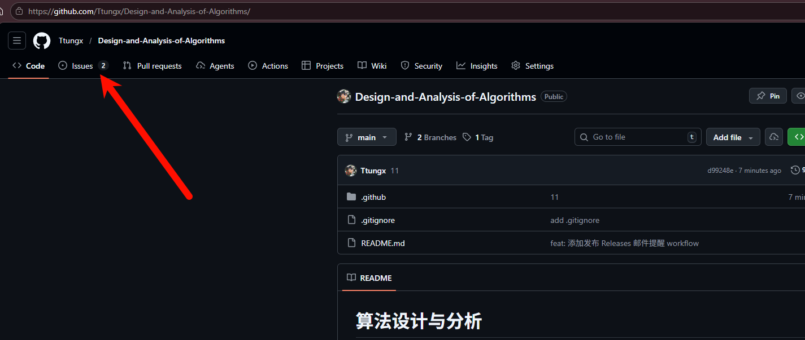
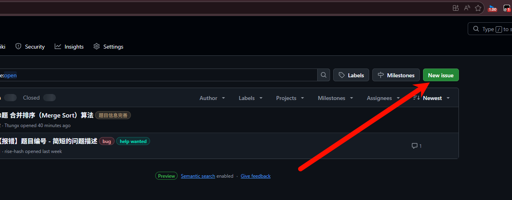
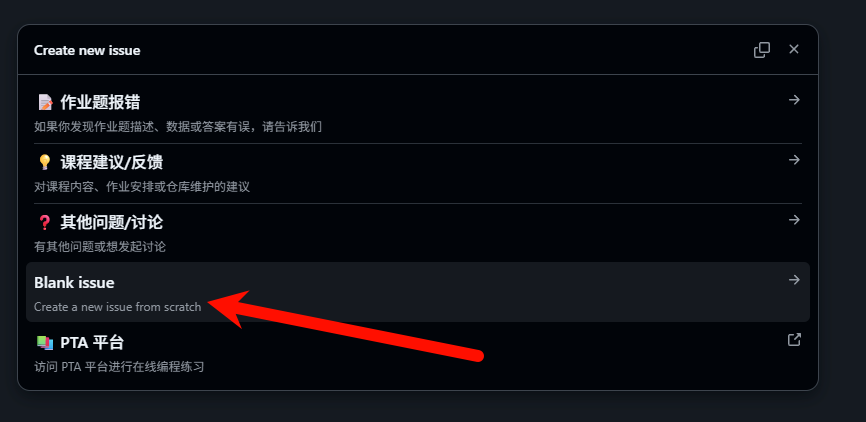
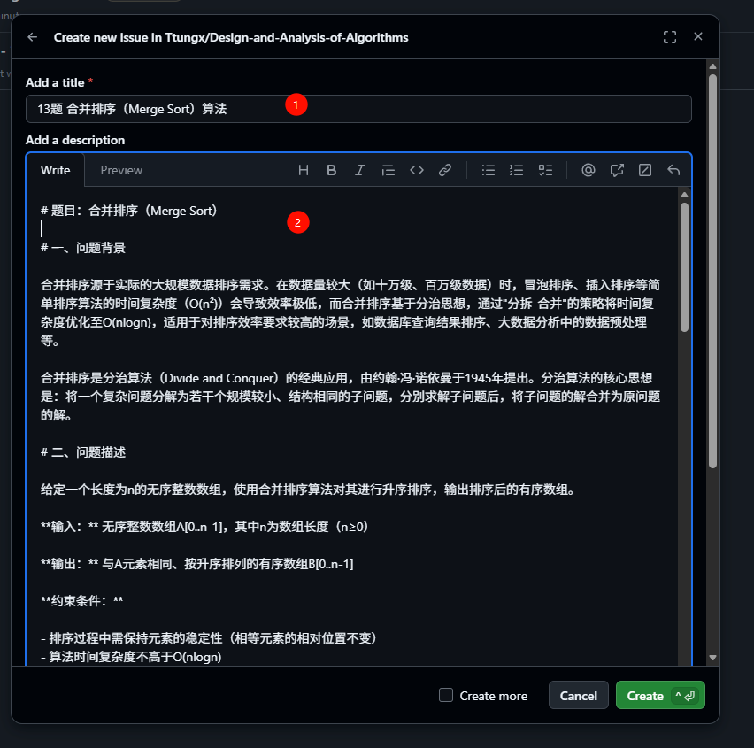
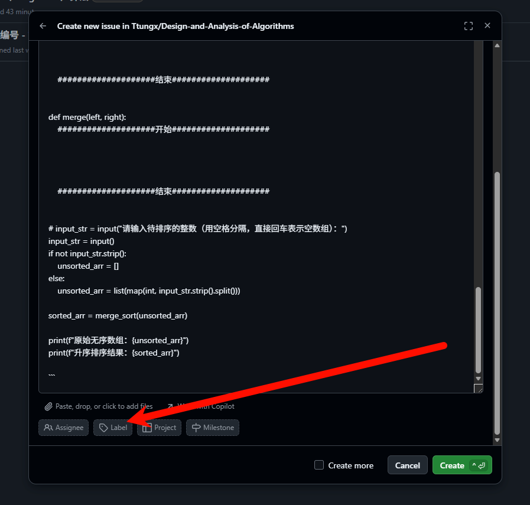
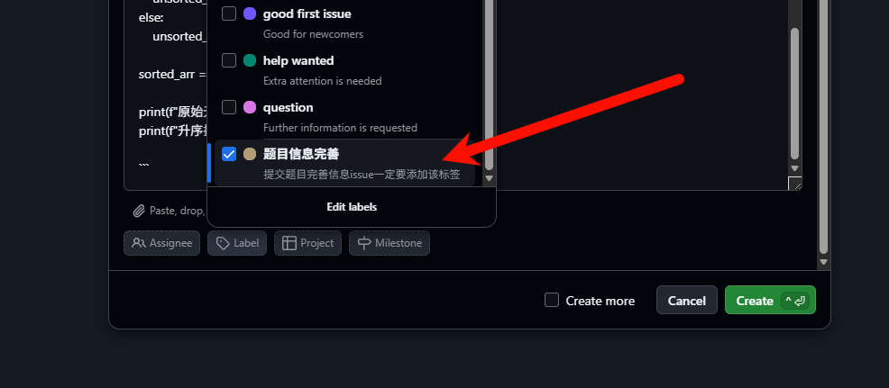
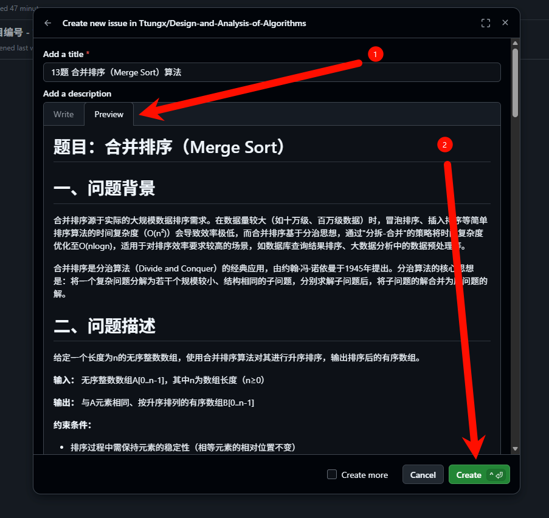

分配名单：PTA题目分配名单

> 按照班级名单从上到下分配原则

---

## 任务说明

每个人根据分配的题目将PTA上的题目内容按照模板重新整理到新的markdown文件中

时间要求：五一之前整理完毕

### 微云说明

[微云网盘](https://www.weiyun.com/disk/sharedir/f209e6100541fbc2bbebf3cacc68732c)中要上传个人有关这门课的文件，比如这里提到的题目描述文件，还有PPT、代码等。

上传时先本地创建好文件夹存好文件再点击上传文件夹（网盘页面无法直接创建文件夹）

### 任务要求说明

严格按照 [题目描述（模板）.md](题目描述（模板）.md) 中的要求填充对应的信息。

很多题目信息是实验报告形式的，这种题目不需要大改，只需要精简题目信息（将原题目冗长的题目背景、实验目的等等信息缩减或删除），保留题目信息核心即可。

要大改的题目都不是实验报告样式的题目，此类题目往往需要补充 [题目描述（模板）.md](D:\mytmp\算法设计与分析分配\题目分配\题目描述（模板）.md) 中的问题背景、问题描述、设计思路、以及最重要的测试集（测试集必须自己跑通后再写）

大部分任务可以交给AI完成，但是测试集务必自己跑通，

补充完的题目信息一定要在[仓库]([Ttungx/Design-and-Analysis-of-Algorithms: 24网安算法设计与分析](https://github.com/Ttungx/Design-and-Analysis-of-Algorithms))提Issue，当收到确认的评论或者issue被关闭后才能在微云中上传题目文件，不会操作的同学一定要让别人给你提Issue或者看下面的步骤自己学，==这是非常重要的技能==。

提完Issue到共享文档PTA题目分配名单中及时完善信息

> 有任何问题请微信联系

**已经补充好的内容看“示例”文件夹**

### 注意

题目信息采用 MarkDown 语言，语法很简单，建议看[这个视频]([8分钟让你快速掌握Markdown_哔哩哔哩_bilibili](https://www.bilibili.com/video/BV1JA411h7Gw/?share_source=copy_web&vd_source=fd5921e1530bb1becd33c093b33c8100))快速学习相关语法，以免破坏模板内容，因为PTA平台会根据上传的md文件自动识别测试集

## 提issue步骤

点击 `Issue`

点击 `New Issue`

点击 `Blank issue`（空白issue）

title中填入题号+题目原始标题，description中粘贴你按照模板补充完的完整markdown内容，接着划到最后，点击 `Lable`，下滑找到 `题目信息完善`标签，打上勾

点击 `Preview ` 可以预览你提交的内容，没问题后点击 `Create` 发起issue，

示例issue请点击[13题 合并排序（Merge Sort）算法 · Issue #3 · Ttungx/Design-and-Analysis-of-Algorithms](https://github.com/Ttungx/Design-and-Analysis-of-Algorithms/issues/3)

---

